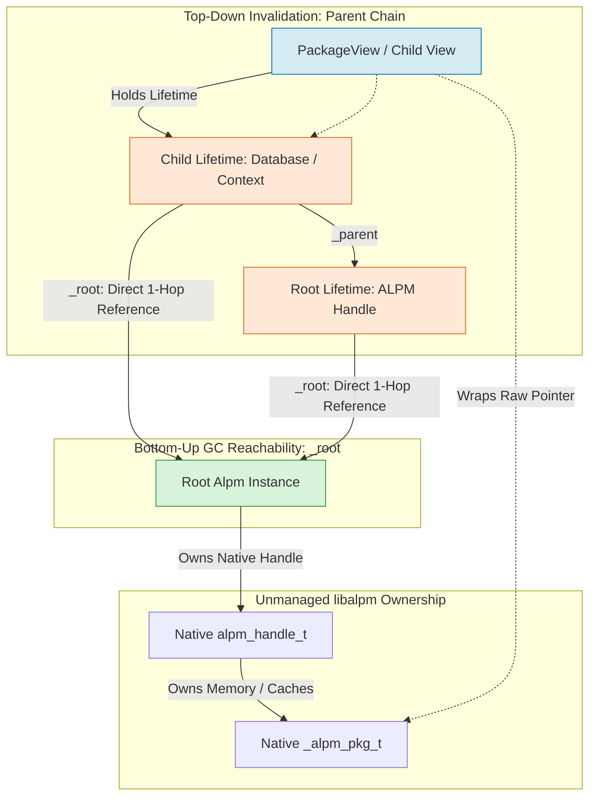

# Architecture Reference: Borrowed Views, Lifetime Tokens, and Memory Safety in Pacpar.Alpm

> **Document Status**: Approved Architecture Specification & Technical Design Reference  
> **Audience**: Library Maintainers, Application Developers, and DocFX Documentation  
> **Related Components**: `Pacpar.Alpm.Lifetime`, `Pacpar.Alpm.PackageView`, `Pacpar.Alpm.AlpmLifetimeException`, `Pacpar.Alpm.List.AlpmList<T>`

---

## 1. Executive Summary & Problem Definition

`Pacpar.Alpm` provides high-performance .NET bindings for Arch Linux's unmanaged `libalpm` C library. The architecture reconciles two competing engineering requirements:

1. **Zero-Allocation Bulk Performance**: Querying package databases (`pacman -Q` / `pacman -Ss`) across tens of thousands of packages must avoid allocating managed metadata snapshots eagerly. Thin views wrapping raw native pointers (`_alpm_pkg_t*`) execute in **114.5 μs** for 2,455 packages (~46.6 ns/package), compared to **134.0 ms** for full eager snapshots—a **1,170x** throughput advantage.
2. **Deterministic Memory Safety in a Managed Runtime**: C# lacks compile-time borrow lifetimes (`&'a Package`) and C++ RAII scope destructors for borrowed memory. If unmanaged memory is released while a managed view wrapper remains in scope, subsequent reads trigger use-after-free (UAF), silent heap corruption, or fatal `SIGSEGV` aborts.

### The Core Hazard: Finalizer Race Conditions & TOCTOU

Unmanaged memory in `libalpm` is rooted in an opaque handle (`alpm_handle_t*`) managed by the root `Alpm` class. When a consumer acquires a borrowed `PackageView` and drops references to the parent `Alpm` instance:

```
[User Thread]                         [GC / Finalizer Thread]
alpm = new Alpm(...)
pkg = alpm.LocalDb.GetPackage("glibc")
// alpm no longer referenced
DoUnrelatedWork()  -----------------> GC detects alpm unreachable
                                      ~Alpm() runs concurrently
                                      alpm_release(handle) frees package memory
pkg.Version (DEREFERENCES FREED MEMORY) -> SIGSEGV / Memory Corruption!
```

1. **Liveness Optimization**: In .NET Release builds without a debugger attached, the JIT compiler calculates stack and register liveness aggressively. An object becomes eligible for garbage collection at its *last instruction of use*, not at the end of the enclosing C# block.
2. **Concurrent Finalization**: The GC finalizer thread runs independently of application threads. If `Alpm` is collected, `~Alpm()` calls `alpm_release(handle)`, deallocating package and database memory.
3. **Time-of-Check to Time-of-Use (TOCTOU)**: Placing a plain boolean `_alive` flag on the view cannot prevent this race. A user thread can observe `_alive == true`, and before it completes pointer dereference in the next CPU instruction, the finalizer executes `alpm_release()`, resulting in a fatal fault.

---

## 2. Core Architectural Pattern: The Root-Anchored Lifetime Token Tree

To guarantee memory safety without degrading read performance with locks or reference-counting bus overhead, `Pacpar.Alpm` implements the **Root-Anchored Lifetime Token Tree** pattern.



### The Dual-Axis Guarantee

The architecture enforces safety along two orthogonal axes:

1. **GC Reachability Anchoring (Bottom-Up Axis $\rightarrow$ `_root`)**:
   - Every `Lifetime` token directly stores a strong reference (`private readonly object _root`) pointing to the root unmanaged resource owner (`Alpm` or `LoadedPackage`). Child tokens inherit `_root` from their parent during `CreateChild()`.
   - Every borrowed view (`PackageView`, `FileList`, `AlpmList<T>`) holds a `Lifetime` token (`private protected Lifetime? Lifetime`).
   - **The CLR Invariant**: As long as user code retains a reference to any borrowed view, the root `Alpm` instance is directly reachable in the CLR object graph (`View -> Lifetime -> _root`). The GC **cannot** collect `Alpm`, and `~Alpm()` **cannot execute**. The finalizer TOCTOU race is eliminated at its origin without multi-hop traversal.

2. **Hierarchical Lifetime Invalidation (Top-Down Axis $\rightarrow$ `_parent`)**:
   - When native memory is explicitly invalidated by caller actions (`Alpm.Dispose()`, `Database.Unregister()`, `Transactions.Commit()`, or `Transactions.Dispose()`), the affected `Lifetime` token sets its volatile `_alive` flag to `false`.
   - Token checks follow parent chains:
     $$\text{IsAlive} \iff \text{\_alive} \land (\text{\_parent} \text{ is null} \lor \text{\_parent.IsAlive})$$
   - Invalidating a parent token invalidates its entire subtree in $O(1)$ time without enumerating child views.
   - Property accesses on views invoke `Lifetime.ThrowIfStale()` and throw a structured `AlpmLifetimeException` instead of dereferencing dead pointers.
   - Checking `ThrowIfStale()` requires only a single `volatile bool` read on x86-64 (~0.4 ns), adding negligible overhead (+1.7% in real metadata read benchmarks).

---

## 3. Lifetime Token Propagation Map

### 3.1 Unmanaged List Traversal (`delegate*<void*, Lifetime?, T>`)

In `src/Pacpar.Alpm/List/AlpmList.cs`, native linked lists (`_alpm_list_t*`) are traversed using an unmanaged element factory function pointer:

```csharp
internal readonly unsafe delegate*<void*, Lifetime?, T> Factory;
```

`Factory` is a static C# function pointer (`calli`). It carries no hidden `this` pointer and allocates zero managed closures during hot enumeration loops. Expanding the signature by one register parameter (`Lifetime?`) enables lifetime tokens to propagate from lists to views on the fly.

#### Nullability Contract of `Lifetime?`
The parameter is nullable because certain list instances legitimately possess no parent unmanaged context:
- `new AlpmStringList()` (empty wrapper around a `null` pointer).
- Detached diagnostic payloads materialized inside `ErrorHandler` (`DepMissing`, `Conflict`, `FileConflict`).
- Self-contained string lists.

For views that require an active context (`Database`, `PackageView`), the factory validates or stores the token. If an unattached view receives `null`, token validation is gracefully bypassed.

### 3.2 Propagation into `AlpmOwnedList<T>.Take`

`AlpmOwnedList<T>` represents caller-owned native lists that must be freed using `alpm_list_free` / `alpm_list_free_inner`. It is used exclusively inside helper methods such as `AlpmStringList.Take` and `Group.FindGroupPackages`:

```csharp
internal static unsafe IReadOnlyList<T> Take(
    _alpm_list_t* list,
    delegate*<void*, Lifetime?, T> factory,
    delegate* unmanaged[Cdecl]<void*, void> innerFree,
    Lifetime? lifetime = null)
{
    using var owned = new AlpmOwnedList<T>(list, factory, innerFree, lifetime);
    return owned.ToArray();
}
```

**Architectural Invariant**: The caller token is stored in `base.Lifetime`. This serves two essential functions:
1. `owned.ToArray()` validates `Lifetime?.ThrowIfStale()` prior to reading unmanaged list nodes.
2. The token is forwarded to `factory(node->data, Lifetime)`. For methods like `Group.FindGroupPackages(dbs)`, the resulting `PackageView` elements inherit `dbs.Lifetime`, preventing them from becoming unguarded dangling views.
3. If `ToArray()` throws an exception, `using var owned` ensures `owned.Dispose()` executes, deallocating native linked-list nodes and preventing memory leaks.

### 3.3 Classification of Produced Elements

| Category | Native Pointer Retained? | Factory Action on `Lifetime` | Examples |
| :--- | :---: | :--- | :--- |
| **1. Direct Pointer Views** | **Yes** | Stores `Lifetime` in a field; verifies `ThrowIfStale()` on property/method entry. | `PackageView`, `Database`, `FileList` |
| **2. Compound Objects** | **No** | Copies metadata into managed fields, passes `Lifetime` to child collections. | `Group` (passes token to `Group.Packages`) |
| **3. Eager Snapshots** | **No** | Copies unmanaged fields into managed strings/primitives on construction; detached. | `Depend`, `Backup`, `string`, `DepMissing`, `Conflict` |

### 3.4 Complete Propagation & Call-Site Map

| Call Site File & Method | Native Source | Token Passed to Factory / View | Invalidation Trigger |
| :--- | :--- | :--- | :--- |
| `Database.cs`: `GetPackage(name)` | `alpm_db_get_pkg` | `this.Lifetime` (Database child token) | `db.Unregister()`, `Alpm.Dispose()` |
| `Database.cs`: `GetPackageCache()` | `alpm_db_get_pkgcache` | `this.Lifetime` (Database child token) | `db.Unregister()`, `Alpm.Dispose()` |
| `Database.cs`: `GetServers()` / `GetCacheServers()` | `alpm_db_get_servers` | `this.Lifetime` (Database child token) | `db.Unregister()`, `Alpm.Dispose()` |
| `Database.cs`: `GetGroup(name)` / `GetGroupCache()` | `alpm_db_get_groupcache` | `this.Lifetime` (Database child token) | `db.Unregister()`, `Alpm.Dispose()` |
| `Packages.cs`: `Licenses` / `Groups` | `alpm_pkg_get_licenses` | `this.Lifetime` (PackageView token) | Owner database, handle, or package freed |
| `Packages.cs`: 7 Dependency Lists (`Depends`, etc.)| `alpm_pkg_get_depends` | `this.Lifetime` (PackageView token) | Owner database, handle, or package freed |
| `Packages.cs`: `Files` | `alpm_pkg_get_files` | `this.Lifetime` (PackageView token) | Owner database, handle, or package freed |
| `Packages.cs`: `Backup` | `alpm_pkg_get_backup` | `this.Lifetime` (PackageView token) | Owner database, handle, or package freed |
| `Groups.cs`: `Group.Packages` | `group->packages` | Inherited Database `Lifetime` | Issuing database unregistered or freed |
| `Groups.cs`: `Group.FindGroupPackages(dbs)` | `alpm_find_group_pkgs`| `dbs.Lifetime` (Root handle token) | `Alpm.Dispose()` |
| `Alpm.cs`: `GetLocalDatabase()` | `alpm_get_localdb` | Dedicated `_localDatabase` child token | `Transactions.Commit()`, `Alpm.Dispose()` |
| `Alpm.cs`: `GetSyncDatabases()` | `alpm_get_syncdbs` | Root `_lifetime` (elements resolve child)| `Alpm.Dispose()` |
| `Alpm.cs`: `RegisterSyncDatabase(...)` | `alpm_register_syncdb` | Dedicated per-pointer child token | `db.Unregister()`, `UnregisterAllSyncDatabases`|
| `Transactions.cs`: `GetAddedPackages()` / `GetRemoved` | `alpm_trans_get_add` | `this.Lifetime` (Transaction child token) | `trans.Dispose()`, `Alpm.Dispose()` |
| `Transactions.cs`: `AddPackage(LoadedPackage)` | Staged package | `this.Lifetime` (Transaction child token) | `trans.Dispose()`, `Alpm.Dispose()` |
| `Callback.cs`: `EventType.FromUnion` | Native event struct | Root `_lifetime` (via weak reference) | `Alpm.Dispose()` |
| `Callback.cs`: `QuestionType.FromUnion` | Native question struct | Root `_lifetime` (via weak reference) | `Alpm.Dispose()` |
| `Options.cs`: 9 Option Collections | `alpm_option_get_*` | Root `_lifetime` | `Alpm.Dispose()` |

---

## 4. Check Granularity & Empirical Performance

A critical performance design decision is where `Lifetime.ThrowIfStale()` checks must be placed.

### 4.1 Benchmark Measurements

Live system benchmarks (2,455 packages, AMD Ryzen 7 9700X, BenchmarkDotNet 0.15.6) measured the exact cost of check placement strategies:

| Scenario | Check at Entry Only | Check Entry + Every `Current` | Delta | Overhead / Package |
| :--- | ---: | ---: | ---: | ---: |
| Single `ThrowIfStale()` check (Root token) | 0.20 ns | — | — | — |
| Single `ThrowIfStale()` check (Child token) | 0.39 ns | — | — | — |
| Pure enumeration of 2,455 packages (no property reads) | 14,132.7 ns (5.8 ns/pkg) | 16,017.5 ns (6.5 ns/pkg) | +13.3% | +0.77 ns/pkg |
| Enumerate and read `Name` + `Version` (`pacman -Q` shape) | 109,532.7 ns (44.6 ns/pkg) | 111,441.0 ns (45.4 ns/pkg) | **+1.7%** | **+0.78 ns/pkg** |
| Every property getter checks (two getters) | — | 117,123.6 ns | +6.9% | +3.09 ns/pkg (~1.5 ns/check) |
| `Current` + Getters all check | — | 119,797.5 ns | +9.4% | +4.18 ns/pkg |

### 4.2 Guard Placement Invariants

1. **`GetEnumerator()` & `ToArray()` Check Entry**: Ensures invalid collections fail fast before touching native pointer heads.
2. **`Current` Checks Every Item**:
   ```csharp
   public T Current
   {
       get
       {
           if (_disposed) throw new ObjectDisposedException(GetType().FullName);
           if (!_started || _current == null) throw new InvalidOperationException();
           _list.Lifetime?.ThrowIfStale(); // GUARD
           return _list.Factory(_current->data, _list.Lifetime);
       }
   }
   ```
   If a database is unregistered mid-loop, accessing `Current` throws `AlpmLifetimeException` before calling `Factory`. This prevents factories that eagerly dereference fields (`Group`, `File`) from crashing inside unmanaged code.
3. **`MoveNext()` Is Deliberately Unchecked**:
   `MoveNext()` only advances `_current = _current->next`. Adding checks inside `MoveNext()` would add another check per element, doubling iteration overhead. 
   - **Why this is safe against GC finalization**: The `Enumerator` holds `_list`, which holds `Lifetime`, which holds `_root` (`Alpm`). The GC cannot collect `Alpm` while enumeration is in progress.
   - **Self-invalidation edge case**: If user code explicitly calls `db.Unregister()` within the loop on the same thread, `MoveNext()` advances through memory just freed. Because `Current` checks immediately afterward, it traps the invalid state before element materialization.

---

## 5. Unmanaged Invalidation Sites & Operational Invariants

### 5.1 Strict Invalidation Order Rule

Every unmanaged deallocation site in `Pacpar.Alpm` obeys this invariant:
$$\text{Native Release Call} \longrightarrow \text{Verify Success / Errno} \longrightarrow \text{Invalidate Lifetime Token} \longrightarrow \text{Prune Registry}$$

*Rationale*: If the native release fails (e.g. `alpm_release` returns `ALPM_ERR_TRANS_NOT_NULL`), native memory was **not** deallocated. Invalidating the token on failure would cause false-positive exceptions on still-valid resources.

---

### 5.2 `Database.Unregister()` (`src/Pacpar.Alpm/Database.cs`)

```csharp
public void Unregister()
{
    ThrowIfInvalidated();

    var err = NativeMethods.alpm_db_unregister(backingStruct);
    if (err != 0) throw ErrorHandler.ToException(NativeMethods.alpm_errno((_alpm_handle_t*)AsHandle()));

    // Invalidate strictly after native release succeeds:
    Lifetime.Invalidate("Database.Unregister()");

    // Prune registry so subsequent allocations at this address receive a fresh token:
    Lifetime.Parent?.ForgetHandle(backingStruct);
}
```

#### The `ForgetHandle` Architectural Tradeoff
- **Address Recycling**: `libalpm` relies on `malloc()`. If a database is unregistered and a new database is subsequently registered, the OS allocator frequently reuses the same memory address. If the registry retained the dead token, the new database would inherit an already-invalidated token (zombie token).
- **Pruning**: `ForgetHandle` drops the registry entry. Future registrations at that address obtain a clean, live token.
- **Consumer Concurrency Contract**: Pre-issued `AlpmList<Database>` collections obtained prior to `Unregister()` must not be re-enumerated across registry modifications.

---

### 5.3 `Alpm.UnregisterAllSyncDatabases()` & Local Database Isolation

```csharp
public unsafe void UnregisterAllSyncDatabases()
{
    ThrowIfDisposed();
    var err = NativeMethods.alpm_unregister_all_syncdbs(_handle);
    if (err != 0) throw GetRequiredCurrentError();

    // Invalidate all registered sync database tokens in one sweep:
    _lifetime.InvalidateHandles("Alpm.UnregisterAllSyncDatabases()");
}
```

#### Local Database Token Isolation
`alpm_unregister_all_syncdbs` frees **only** sync databases; the local database remains active. If the local database token were registered in `_handles`, calling `UnregisterAllSyncDatabases()` would inadvertently invalidate local database views. Therefore:
- Sync database tokens are registered in `_lifetime._handles`.
- The local database token is stored separately in `Alpm._localDatabase`.
- `InvalidateHandles()` affects only sync databases.

---

### 5.4 `Alpm.Dispose()` & Atomic Finalizer Tombstone

```csharp
private int _disposeStarted;
private int _disposedFlag;

internal bool Disposed => Volatile.Read(ref _disposedFlag) != 0;

protected virtual unsafe void Dispose(bool disposing)
{
    // Atomic gate: exactly one entrant proceeds (races between Dispose and ~Alpm)
    if (Interlocked.CompareExchange(ref _disposeStarted, 1, 0) != 0) return;

    CurrentTransaction?.Dispose();

    var releaseErr = NativeMethods.alpm_release(_handle);
    var releaseFailure = disposing && releaseErr != 0 ? ErrorHandler.ToException(Errno) : null;
    _handle = (_alpm_handle_t*)IntPtr.Zero;

    if (releaseErr == 0)
    {
        _lifetime.Invalidate(
            disposing ? "Alpm.Dispose()" : "the owning Alpm was garbage-collected",
            fromFinalizer: !disposing);

        Callback.Dispose();
    }

    Marshal.FreeHGlobal((nint)_initializeErrno);
    Volatile.Write(ref _disposedFlag, 1);

    if (releaseFailure != null) throw releaseFailure;
}
```

#### Finalizer Safety Invariants
1. **Never Enumerate Managed Collections**: `_lifetime.Invalidate(..., fromFinalizer: true)` flips `_alive = false` via a volatile write ($O(1)$) and avoids enumerating `_handles`.
2. **Transaction Cleared First**: Releasing an active transaction drops `db.lck`. If not released first, `alpm_release` returns `ALPM_ERR_TRANS_NOT_NULL` and native resources leak.

---

### 5.5 Callback Architecture & The Circular GC Root Hazard

`Callback` registers native function pointers (`[UnmanagedCallersOnly]`) with `libalpm`. It retains an unmanaged context via `GCHandle<Callback> _ctxHandle`.

#### The Circular Reference Hazard
If `Callback` held a strong reference to `Lifetime`:
$$\text{GC Handle Table} \longrightarrow \text{GCHandle} \longrightarrow \text{Callback} \longrightarrow \text{Lifetime} \longrightarrow \text{\_root (Alpm)}$$
Because the CLR GC Handle Table is an immortal root, `Alpm` would **never be collected by the GC**. If a caller forgot to invoke `Dispose()`, `~Alpm()` could never run, resulting in permanent native handle and `db.lck` leaks.

#### The Weak Reference Solution
`Callback` maintains its reference weakly:
```csharp
private readonly WeakReference<Lifetime> _lifetimeRef;

private Lifetime? LifetimeOrNull() =>
    _lifetimeRef.TryGetTarget(out var lifetime) ? lifetime : null;
```
1. **Guaranteed Resolution**: Callbacks only execute synchronously while an unmanaged `libalpm` call is running on an application thread. During this execution, `Alpm` is on the calling thread's activation frame, ensuring `LifetimeOrNull()` resolves successfully.
2. **Cycle Broken**: When user code drops references to `Alpm`, the weak reference allows `Alpm` to be garbage collected and finalized cleanly.
3. **Graceful Degradation**: If an edge case occurs where the reference cannot be resolved, callback views degrade to unattached views (`Lifetime = null`) rather than throwing fatal exceptions across the FFI boundary.

---

### 5.6 `Transactions.Commit()` & Local Database Token Invalidation

```csharp
public unsafe void Commit()
{
    ThrowIfDisposed();
    _alpm_list_t* messages = null;
    var err = NativeMethods.alpm_trans_commit((_alpm_handle_t*)_library.AsHandle(), &messages);
    if (err != 0)
        throw AlpmTransactionException.TakeFailure(_library.Errno, messages, "Failed to commit transaction");

    // Conservative cache invalidation:
    _library.InvalidateLocalDatabase("Transactions.Commit()");
}
```

#### Invalidation & Null Reset
`InvalidateLocalDatabase` invalidates the existing token and resets the field:
```csharp
internal void InvalidateLocalDatabase(string reason)
{
    _localDatabase?.Invalidate(reason);
    _localDatabase = null;
}
```
- **Why `_localDatabase = null` is mandatory**: Committing packages frees removed/upgraded packages in `libalpm`'s internal local database cache. Old views must throw `AlpmLifetimeException`. Resetting the field to `null` ensures the next call to `alpm.GetLocalDatabase()` lazily creates a **fresh, active child token** (`_localDatabase ??= _lifetime.CreateChild("the local database")`), allowing subsequent local database queries to succeed.

---

### 5.7 `Transactions.Dispose()`

```csharp
public unsafe void Dispose()
{
    if (_released) return;
    _released = true;
    GC.SuppressFinalize(this);

    if (_library.Disposed) return;

    var err = NativeMethods.alpm_trans_release((_alpm_handle_t*)_library.AsHandle());
    _library.CurrentTransaction = null;

    if (err == 0) Lifetime.Invalidate("Transactions.Dispose()");
}
```
`alpm_trans_release` deallocates packages loaded via `alpm_pkg_load` that were transferred to the transaction. Invalidating `Lifetime` on successful release ensures that views returned from `GetAddedPackages()` or `AddPackage(LoadedPackage)` throw `AlpmLifetimeException` on subsequent reads.

---

### 5.8 `LoadedPackage.Dispose()` & `Disown()`

`LoadedPackage` wraps a package loaded from disk via `alpm_pkg_load`. It owns the native struct and acts as its own lifetime root:
```csharp
public sealed unsafe class LoadedPackage : PackageBase, IDisposable
{
    private readonly Lifetime _lifetime;

    internal LoadedPackage(_alpm_pkg_t* backingStruct) : base(backingStruct)
    {
        _lifetime = Lifetime.CreateRoot(this, "a loaded package");
        Lifetime = _lifetime;
    }
}
```

- **`Dispose()`**: Frees the native pointer via `alpm_pkg_free` and invalidates `_lifetime` with `"LoadedPackage.Dispose()"`.
- **`Disown()`**: When handed to a transaction via `transaction.AddPackage(loadedPkg)`, ownership transfers to `libalpm`. `Disown()` marks the instance as disposed and invalidates `_lifetime` with `"the hand-over to a transaction"`. The transaction returns a new `PackageView` bound to the transaction's lifetime.
- **Base Class Field Mutability**: `PackageBase.Lifetime` is declared `private protected Lifetime? Lifetime` (not `readonly`). This accommodates C# language rule CS0027 (`this` cannot be passed to a base constructor initializer), allowing `LoadedPackage` to assign `Lifetime = _lifetime` in its constructor body.

---

## 6. Evaluated Alternatives & Architectural Rationale

| Strategy | Description | Safety Guarantee | Read Overhead | Ergonomics Impact | Verdict |
| :--- | :--- | :--- | :--- | :--- | :--- |
| **Option 1: No Guard (User Discipline)** | Do not anchor `Alpm`; rely on documentation warning callers not to drop `Alpm`. | **Fails**. TOCTOU race under GC pressure; `SIGSEGV` in production. | 0 ns | Clean | **Rejected**: Fragile; violates memory safety guarantees of managed code. |
| **Option 2: Manual Leases / SafeHandle Refcounts** | Wrap views in `IDisposable` leases or execute `SafeHandle.DangerousAddRef` on getters. | High. Deterministic refcounting. | +25–50 ns per property read (atomic bus locks). | **Destructive**. Breaks LINQ/`foreach`; high risk of handle leaks. | **Rejected**: More than doubles package query latency; terrible ergonomics. |
| **Option 3: Root Anchor + Lifetime Tree** | Views hold `Lifetime`; root token anchors `Alpm`; explicit invalidation via token. | **Absolute**. GC reachability prevents finalization; tokens trap explicit disposal. | ~0.4 ns (single volatile read). | Fully idiomatic; standard LINQ/`foreach` works naturally. | **Selected Architecture**. |

### Rejection Rationale for Struct Variants

- **`ref struct PackageView` (Variant B-3)**: Prevents heap escaping at compile time (CS8345, CS0306), but eliminates `IEnumerable<T>`, LINQ, async methods, and `ToArray()`. Most critically, **`ref struct` cannot prevent explicit invalidation** (`db.Unregister()` while a ref struct local is active still crashes).
- **`readonly struct PackageView` (Variant B-2)**: Eliminates wrapper object allocations, but requires fetching cached properties from an unmanaged table. Benchmarks demonstrate that dictionary lookups per property read exceed the cost of the Gen 0 wrapper allocation.

---

## 7. Public API Contract & Consumer Usage Guide

### The Three Tiers of Package Values

`Pacpar.Alpm` provides three distinct package types to balance performance, ownership, and lifetime requirements:

```
+---------------------------------------------------------------------------------------------------+
|                                      PACKAGE TYPE CONTRACTS                                       |
+---------------------------------------------------------------------------------------------------+
|  Type               | Ownership       | Lifetime                       | Primary Use Case         |
| :------------------ | :-------------- | :----------------------------- | :----------------------- |
|  PackageView        | libalpm owned   | Valid while owner is active    | High-throughput queries  |
|  LoadedPackage      | Managed wrapper | Disposable (caller owns file)  | Transaction staging      |
|  PackageSnapshot    | Fully detached  | Indefinite (managed POCO)      | UI models, background ops|
+---------------------------------------------------------------------------------------------------+
```

#### 1. `PackageView` (Borrowed View)
- **Zero-Allocation**: Instantiated cheaply over an existing `_alpm_pkg_t*` pointer.
- **Lifetime Bound**: Valid as long as the parent `Alpm` handle, `Database`, or `Transaction` remains active.
- **GC Safety**: Holding a `PackageView` anchors the root `Alpm` instance against garbage collection.
- **Explicit Invalidation**: If the owning `Database` is unregistered or `Alpm.Dispose()` is called, subsequent property reads throw `AlpmLifetimeException`.

#### 2. `LoadedPackage` (Owned Package Archive)
- Implements `IDisposable`. Represents a package loaded from an on-disk archive (`alpm.LoadPackage(...)`).
- Owns its native struct. Disposing it frees native memory unless ownership was transferred via `transaction.AddPackage(loadedPkg)`.

#### 3. `PackageSnapshot` (Detached POCO)
- A pure managed snapshot that copies all scalar metadata (and optionally file lists) into standard C# strings and collections.
- Safe to retain across asynchronous boundaries, long-lived DI services, and background threads.
- Created explicitly via `packageView.ToSnapshot(includeFiles: false)`.

---

### Best Practices for Consumers

#### 1. High-Performance Scans: Use Borrowed `PackageView` Directly
```csharp
using var alpm = new Alpm("/", "/var/lib/pacman");
var localDb = alpm.GetLocalDatabase();

foreach (var pkg in localDb.GetPackageCache())
{
    // Fast, zero-allocation reads via PackageView
    Console.WriteLine($"{pkg.Name} {pkg.Version}");
}
```

#### 2. Long-Term Retention: Convert to Snapshot Before Exiting Scope
```csharp
List<PackageSnapshot> longLivedList = [];
using (var alpm = new Alpm("/", "/var/lib/pacman"))
{
    var localDb = alpm.GetLocalDatabase();
    var pkg = localDb.GetPackage("linux");
    if (pkg != null)
    {
        // Detaches metadata from unmanaged memory
        longLivedList.Add(pkg.ToSnapshot());
    }
} // alpm is disposed here

// Safe: Snapshot survives disposal of native handle
Console.WriteLine($"Saved Linux version: {longLivedList[0].Version}");
```

#### 3. Handling Lifetime Exceptions
```csharp
try
{
    PackageView staleView;
    using (var alpm = new Alpm("/", "/var/lib/pacman"))
    {
        staleView = alpm.GetLocalDatabase().GetPackage("glibc")!;
    } // alpm.Dispose() invalidates the token tree

    _ = staleView.Description; // Throws AlpmLifetimeException
}
catch (AlpmLifetimeException ex)
{
    Console.WriteLine($"Resource invalidated: {ex.Target} by {ex.InvalidatedBy}");
}
```

---

## 8. Summary of Invariants for Maintainers

1. **Root Lifetime Anchoring**: Any type wrapping a native handle requiring finalization (`Alpm`, `LoadedPackage`) **must** instantiate its root `Lifetime` using `Lifetime.CreateRoot(this, ...)`.
2. **View Propagation**: Every factory producing a borrowed view (`PackageView`, `FileList`, `AlpmList<T>`, `Group`) **must** forward the appropriate `Lifetime` token to the child constructor.
3. **No Dictionary Access in Finalizers**: Finalization routines (`Dispose(disposing: false)`) must only invoke `_lifetime.Invalidate(reason, fromFinalizer: true)`. They must never iterate, modify, or inspect `_handles`.
4. **Property Access Guards**: All property accessors on `PackageBase`, `FileList`, and `Database` that dereference unmanaged pointers must invoke `ThrowIfDisposed()` and `Lifetime.ThrowIfStale()` prior to calling `NativeMethods.*`.
5. **Thread Affinity**: Borrowed views are non-thread-safe due to `libalpm`'s single-threaded handle model. Cross-thread dispatch requires calling `ToSnapshot()` on the owning thread.
